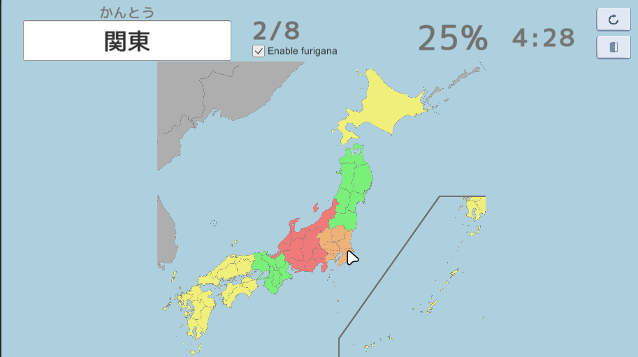
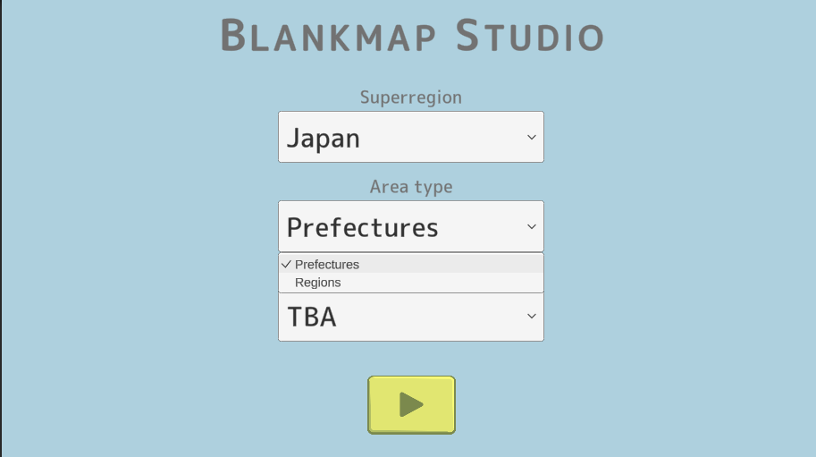
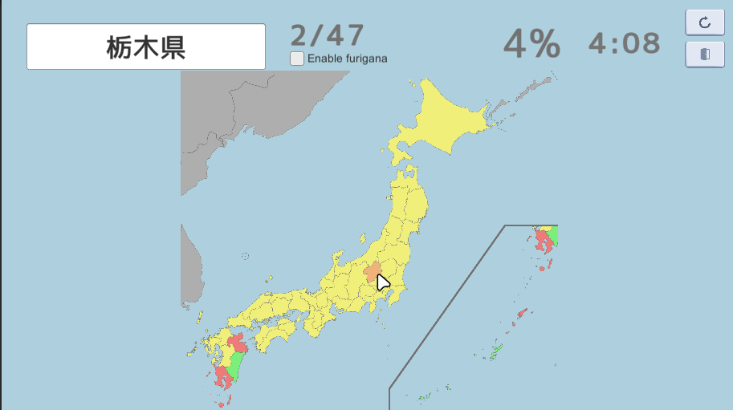
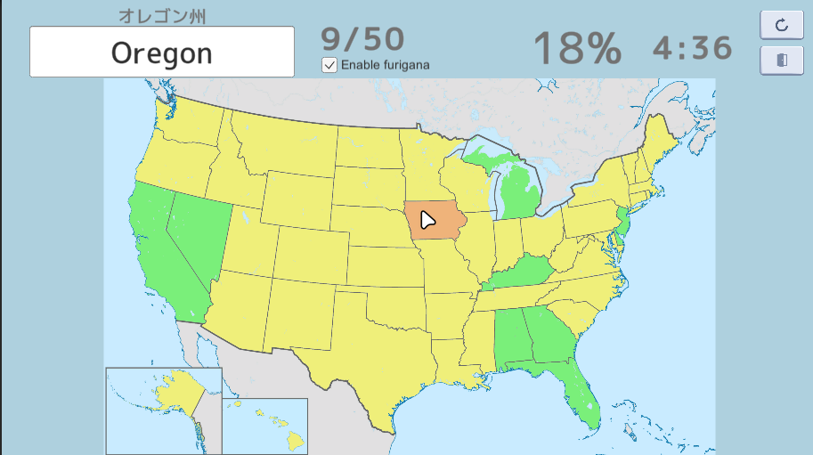

# Blankmap Studio
This is an educational game that lets you memorize subdivisions of maps. The concept and layout is heavily inspired by the map quizzes found on Sporcle.

# Extensible
Easily add new areas and region types using [Generate Blankmaps](https://github.com/anderudp/GenerateBlankmaps).

Continously expanding to new areas...

# Modular
(TBA) Customize game rules and behavior using a simple JSON-based markup.

# Attribution
All maps found in `Assets/Resources` are modified versions of the locator map schemes created by Wikimedia Commons, published under the Creative Commons Attribution-Share Alike 3.0 Unported license.

Cursor hover detection on map regions uses [Jeff Johnson's Advanced Polygon Collider](https://assetstore.unity.com/packages/tools/physics/advanced-polygon-collider-52265) licensed under the Standard Unity Asset Store EULA.